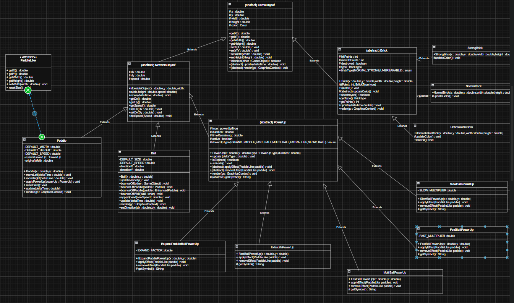

# 🚀 Báo cáo Dự án: Game Arkanoid (JavaFX)

Đây là một bản sao (clone) của trò chơi Arkanoid cổ điển, được xây dựng hoàn toàn bằng JavaFX và CSS. Dự án tái hiện lại game theo một phong cách hoàn toàn khác với chủ đề galaxy đa dạng và đẹp mặt

---

## ✨ Tính năng Nổi bật

Dự án này vượt xa một bản clone cơ bản với các hệ thống phức tạp và hoàn thiện:

### 1. 🎮 Chế độ 1 Người chơi 
* Lối chơi: Phá gạch, ăn power-up, và qua màn.
* **Hệ thống Màn chơi (Levels):** Game đọc các file `.csv` để tự động tạo các màn chơi, cho phép mở rộng vô hạn.
* **Tăng độ khó:** Tốc độ bóng tự động tăng dần sau mỗi vài màn chơi.

### 2. ⚔️ Chế độ 2 Người chơi (Versus Mode)
* Một chế độ chơi đối kháng **chia đôi màn hình** thời gian thực.
* Hai người chơi thi đấu đồng thời trên hai sân chơi riêng biệt, với logic, điểm số, mạng sống, và bộ gạch hoàn toàn như nhau và độc lập.
* Người chiến thắng được quyết định dựa trên điểm số khi cả hai người chơi đều hết mạng.

### 3. 💾 Hệ thống Lưu Game (Save/Continue)
* **Tự động Lưu (Auto-Save):** Game tự động lưu trạng thái (vị trí bóng, gạch, power-ups đang hoạt động, điểm, mạng) khi người chơi đóng cửa sổ.
* **Lưu thủ công:** Game cũng tự động lưu khi người chơi chủ động "Thoát về Menu" từ màn hình Tạm dừng.
* **Tiếp tục (Continue):** Nút "Continue" ở Menu chính (`Main.fxml`) chỉ xuất hiện khi phát hiện có file `arkanoid_save.dat` tồn tại.

### 4. 🌎 Hệ thống Map 
* **Cơ chế map:** Dưới 1000 loại maps (cụ thể là 10) đa dạng xuất hiện ngẫu nhiên và vô hạn màn chơi 
* **Level** Càng lên các màn cao, tốc độ quả bóng sẽ nhanh lên một chút đòi hỏi người chơi kĩ thuật tốt.

### 5. 💥 Hệ thống Combo "Streak"
* `GameManager` theo dõi số lần bóng chạm gạch liên tục trong những lượt bóng hợp lệ liên tiếp.
* Đạt được "streak" (chuỗi) sẽ thưởng thêm điểm thưởng (bonus points) khi có chuỗi 4 trở lên.
* Kích hoạt hiệu ứng hình ảnh "Excellent!" với mỗi 4 lần có streak liên tiếp và âm thanh combo đã tai.

### 6. 🎁 Hệ thống Power-Up 
* Các viên gạch bị phá hủy có tỷ lệ (30%) rơi ra các vật phẩm.
* Hệ thống quản lý vật phẩm đang hoạt động, bao gồm cả việc **reset timer** nếu ăn một vật phẩm cùng loại.
* Các loại Power-Up đã triển khai:
    * **`ExpandPaddle`**: Mở rộng paddle về cả chiều dài và chiều rộng (không cộng dồn).
    * **`MultiBall`**: Tách quả bóng gốc thành 3 quả khác nhau.
    * **`FastBall` / `SlowBall`**: Thay đổi tốc độ bóng (có thể cộng dồn).
    * **`ExtraLife`**: Thêm một mạng sống (tối đa 3).

### 7. 🏆 Quản lý Điểm cao 
* `HighScoreManager` tự động lưu Top 10 điểm cao nhất vào file.
* Khi kết thúc game, `GameController` kiểm tra nếu điểm của người chơi lọt vào Top 10.
* Nếu lọt Top 10, popup `NewHighScore.fxml` sẽ xuất hiện, yêu cầu người chơi nhập tên trước khi hiển thị màn hình `GameOver.fxml`.
* Màn hình `HighScores.fxml` hiển thị danh sách điểm cao một cách động (dynamic) và cho phép "Clear" (Xóa) toàn bộ lịch sử.

### 8. 🌟 Hiệu ứng & "Cảm giác Chơi" 
* **Rung màn hình (Camera Shake):** Lớp `CameraShake` tạo hiệu ứng rung động mạnh mẽ khi bóng va chạm mạnh (vỡ gạch, chạm paddle).
* **Trail ball:** hiệu ứng như va đập không khí tạo vệt mở trắng trên đường quả bóng di chuyển.
* **Hiệu ứng Điểm bay:** Lớp `ScoreAnimation` tạo ra các `Label` công điểm bay lên và mờ dần tại vị trí Score trên Board điểm.
* **Hiệu ứng Đếm số:** Điểm số chính trên UI sẽ "đếm" (roll up) thay vì nhảy số tức thời.
* **Hiệu ứng Countdown:** Hiển thị màn hình đếm ngược galaxy mỗi khi bấm nút continue. 
* **Hiệu ứng Hover** Các hover phát sáng khi di chuyển con trỏ chuột tới button.
* **Hiệu ứng nứt gạch** khi bóng chạm tới gạch strong sẽ có những frame animation nứt vỡ.
* **Hiệu ứng Gameover desktop** hiệu ứng game over hiển thị điểm, level đạt được và play again sinh động.
* **Hiệu ứng màu sắc** hiệu ứng Cyberpunk phối màu tham khảo tiêu chuẩn Analogous thu hút người chơi.
* **Animation cho Paddle:** Paddle có hiệu ứng phát sáng (hit animation) khi bóng chạm vào.
### 9. 🛠️ Quản lý Tài nguyên 
* **`TextureManager` (Singleton):** Tải tất cả hình ảnh (sprite sheets) và **lưu vào bộ nhớ đệm (cache)**. Điều này đảm bảo mỗi ảnh chỉ được tải vào bộ nhớ 1 lần, tối ưu hiệu suất.
* **`SoundManager` (Utility):** Tương tự, quản lý việc **cache** và phát các `AudioClip` (hiệu ứng) và nhạc nền (có lặp lại), với các mức âm lượng đã được định nghĩa trước.

---

## 🖥️ Kiến trúc Kỹ thuật

Dự án được xây dựng theo mô hình **MVC (Model-View-Controller)**, tách biệt rõ ràng logic, dữ liệu và giao diện.

### 1. Model (Core Logic)
* **Gói `core`**: Chứa các "bộ não" của game.
* **`GameManager` (Singleton):** Quản lý toàn bộ logic của chế độ 1 người chơi. Nó sở hữu danh sách gạch, bóng, paddle, power-up. Nó xử lý va chạm, điểm số, và trạng thái game (Playing, Paused, GameOver).
* **`VersusGameManager` (Singleton):** Quản lý logic của chế độ 2 người chơi. Nó sở hữu **hai bộ** đối tượng game (2x paddle, 2x lists of balls, 2x lists of bricks) và xử lý va chạm độc lập cho từng người.
* **`HighScoreManager` (Singleton):** Quản lý logic đọc/ghi điểm cao.
* **`GameStatePersistence` (Utility):** Xử lý logic **Tuần tự hóa (Serialization)**. Nó lấy một `GameStateSnapshot` (một POJO chứa trạng thái) từ `GameManager` và lưu xuống file `arkanoid_save.dat`.

### 2. View (Giao diện - FXML)
* **Gói `ui.fxml`**: Chứa các file `.fxml` định nghĩa bố cục.
* **`Main.fxml`**: Màn hình menu chính (dùng `BorderPane`).
* **`GameView.fxml`**: Màn hình 1 người chơi (dùng `HBox` chia 2 cột: Stats và Game Area).
* **`VersusView.fxml`**: Màn hình 2 người chơi (dùng `VBox` chia HUD và Game Area; Game Area dùng `HBox` chia 2 `AnchorPane` cho 2 `Canvas`).
* **Cấu trúc Lớp phủ (Overlay):** `GameView.fxml` và `VersusView.fxml` đều dùng `<StackPane>` làm gốc (hoặc bọc) để có thể **nhúng (embed)** các file FXML khác (như `PauseOverlay.fxml`, `GameOver.fxml`) lên trên bằng thẻ `<fx:include>`. Các overlay này dùng nền `rgba(0,0,0,0.6)` (đen trong suốt) để tạo hiệu ứng "popup" làm mờ game bên dưới.

### 3. Controller (Kết nối)
* **Gói `ui.controller`**: Chứa các class Java "keo dán" (glue) FXML với Model.
* **`GameController` / `VersusController`:**
    * **Khởi chạy:** Khởi tạo `AnimationTimer` (vòng lặp 60 FPS).
    * **Xử lý Input:** Lắng nghe `setOnKeyPressed` và `setOnKeyReleased` từ `Scene`. Khi người dùng nhấn phím, Controller **ra lệnh** cho Model (ví dụ: `gameManager.setMovingLeft(true)`).
    * **Điều phối (Dispatch):** Trong `AnimationTimer`, Controller gọi `gameManager.update(deltaTime)` (để Model chạy logic) và sau đó gọi `gameManager.render(gc)` (để Model vẽ lên `Canvas`).
    * **Cập nhật UI:** Đồng bộ hóa dữ liệu *từ* Model *lên* View (ví dụ: `lblScore.setText(String.valueOf(gameManager.getScore()))`).
* **Các Controller con (ví dụ: `PauseOverlayController`, `GameOverController`):**
    * Quản lý các nút bấm trên các màn hình overlay.
    * Chúng giao tiếp với `GameController` (cha) thông qua các **hàm callback** (ví dụ: `pauseOverlayController.setResumeAction(...)`) hoặc gọi trực tiếp Singleton (ví dụ: `GameManager.getInstance().saveGameState()`).

---

## 🕹️ Logic Lõi: Phân tích Vòng lặp Game (1P)

Vòng lặp game (Game Loop) được điều khiển bởi `GameController` và ủy thác logic cho `GameManager`.

1.  **`GameController`:** Khởi tạo `AnimationTimer`.
2.  **`handle(long now)` (60 lần/giây):**
    * Tính toán `deltaTime` (thời gian giữa các khung hình).
    * Gọi `updateGame(deltaTime)`.
    * Gọi `renderGame()`.
    * Gọi `updateUI()`.
    * Gọi `checkGameOver()`.

3.  **Bên trong `updateGame(deltaTime)`:**
    * Lấy `scoreBefore` từ `GameManager`.
    * Gọi `gameManager.updateGame(deltaTime)`.
        * **Bên trong `gameManager.updateGame(deltaTime)`:**
            * Chỉ chạy nếu `gameState == PLAYING`.
            * Cập nhật `cameraShake.update(deltaTime)`.
            * Di chuyển `paddle` dựa trên cờ (flag) input (`movingLeft` / `movingRight`).
            * Cập nhật tất cả `Ball` (`ball.update(deltaTime)`).
            * Cập nhật tấtá cả `PowerUp` đang rơi.
            * Cập nhật timer của các `PowerUp` đang kích hoạt (xóa nếu hết hạn).
            * Gọi `checkCollisions()`.
            * Gọi `checkGameConditions()` (để xem có qua màn không).
    * Lấy `scoreAfter` từ `GameManager`.
    * Nếu `scoreAfter > scoreBefore`, gọi `scoreAnimation.showScore(...)`.

4.  **Bên trong `renderGame()`:**
    * Lấy giá trị `shakeX`, `shakeY` từ `CameraShake`.
    * `gc.save()`
    * `gc.translate(shakeX, shakeY)` (Di chuyển toàn bộ "camera").
    * Vẽ background.
    * Gọi `paddle.render(gc)`, `ball.render(gc)`, `brick.render(gc)`... (Các đối tượng tự vẽ).
    * `gc.restore()` (Reset "camera" về 0).
    * Vẽ các UI (như "Excellent!", "Countdown") (để chúng không bị rung).

---

## ⌨️ Điều khiển (Controls)

| Chế độ | Người chơi | Di chuyển Trái | Di chuyển Phải | Ngắm/Xoay | Bắn bóng | Tạm dừng |
| :--- | :--- | :--- | :--- | :--- | :--- | :--- |
| **1P** | Player 1 | `A` / `LEFT` | `D` / `RIGHT` | `W` / `S` | `SPACE` | `P` |
| **2P** | **Player 1** | `A` | `D` | `W` / `S` | `SPACE` | `P` |
| **2P** | **Player 2** | `LEFT` | `RIGHT` | `UP` / `DOWN`| `ENTER` | `P` |

---

## Class Diagram



## 🖥️ Video sơ lược về các tính năng game: https://drive.google.com/drive/u/1/folders/1xUeyW-x7O7a1FblPpWyc6fHHiCIXbNaa?hl=vi


## 📂 Cấu trúc Thư mục
``` bash
src/
└── arkanoid/
├── ArkanoidApplication.java    // 🚀 Lớp chính, điểm khởi đầu, xử lý auto-save
│
├── core/                       // 🧠 Logic lõi và quản lý trạng thái
│   ├── GameManager.java        // (Singleton) Bộ não 1 người chơi
│   ├── VersusGameManager.java  // (Singleton) Bộ não 2 người chơi
│   ├── HighScoreManager.java   // (Singleton) Quản lý file điểm cao
│   ├── GameStatePersistence.java // (Utility) Lưu/Tải game
│   ├── GameStateSnapshot.java  // (POJO) Đối tượng để lưu trạng thái
│   └── HighScore.java          // (POJO) Đối tượng cho 1 mục điểm cao
│
├── entities/                   // 🧱 Các đối tượng trong game
│   ├── GameObject.java         // (Abstract) Lớp cha (vị trí, kích thước)
│   ├── MovableObject.java      // (Abstract) Kế thừa GameObject (thêm vận tốc)
│   ├── Ball.java               // Bóng
│   ├── Brick.java              // Gạch
│   ├── BrickFactory.java       // (Factory) Tạo gạch từ file map
│   │
│   ├── Paddle/                 // Gói con cho thanh đỡ
│   │   ├── Paddle.java
│   │   └── PaddleLike.java     // (Interface) Cho phép PowerUp tương tác
│   │
│   └── PowerUp/                // Gói con cho các vật phẩm
│       ├── PowerUp.java        // (Abstract) Lớp cha cho vật phẩm
│       ├── ExpandPaddlePowerUp.java
│       ├── ExtraLifePowerUp.java
│       ├── FastBallPowerUp.java
│       ├── MultiBallPowerUp.java
│       └── SlowBallPowerUp.java
│
├── ui/                         // 🖥️ Giao diện người dùng (FXML, Controllers)
│   ├── controller/
│   │   ├── GameController.java     // -> GameView.fxml
│   │   ├── VersusController.java   // -> VersusView.fxml
│   │   ├── MainController.java     // -> Main.fxml
│   │   ├── PauseOverlayController.java // -> PauseOverlay.fxml
│   │   ├── GameOverController.java // -> GameOver.fxml
│   │   ├── HighScoresController.java // -> HighScores.fxml
│   │   ├── NewHighScoreController.java // -> NewHighScore.fxml
│   │   ├── VersusGameOverController.java // -> VersusGameOver.fxml
│   │   ├── VersusGamePauseOverlayController.java // -> VersusGamePauseOverlay.fxml
│   │   ├── BackgroundHelper.java // (Utility) Đặt ảnh nền
│   │   └── SceneNavigator.java   // (Utility) Chuyển cảnh
│   │
│   └── fxml/                     // Các file bố cục (layout)
│       ├── Main.fxml             // Menu chính
│       ├── GameView.fxml         // Màn hình chơi 1P
│       ├── PauseOverlay.fxml     // Popup tạm dừng 1P
│       ├── GameOver.fxml         // Màn hình thua 1P
│       ├── HighScores.fxml       // Màn hình bảng xếp hạng
│       ├── NewHighScore.fxml     // Popup nhập điểm cao
│       ├── VersusView.fxml       // Màn hình chơi 2P
│       ├── VersusGameOver.fxml   // Màn hình thua 2P
│       └── VersusGamePauseOverlay.fxml // Popup tạm dừng 2P
│
└── utils/                      // 🛠️ Các lớp tiện ích
├── SoundManager.java       // (Utility) Cache và phát âm thanh
├── TextureManager.java     // (Singleton) Cache và tải hình ảnh
├── CameraShake.java        // Xử lý hiệu ứng rung màn hình
└── ScoreAnimation.java     // Xử lý hiệu ứng điểm bay, đếm số
```
